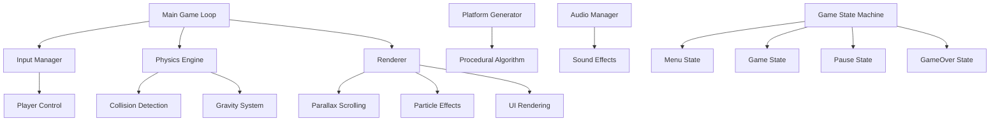

# 🦘 **Doodle Jump SFML**  
### *Vertical Adventure Reimagined*

<p align="center">
  
  
  
  
</p>

<p align="center">
  
  <br>
  <em>✨ Classic mobile nostalgia meets modern desktop polish ✨</em>
</p>

---

## 🚀 **Elevate Your Experience**

> **The iconic vertical platformer, reborn with technical excellence and visual flair.**  
> Jump, dodge, and soar through procedurally generated skies in this lovingly crafted C++/SFML adaptation.

<div align="center">
  
  ```ascii
  ╔══════════════════════════════════════════════════╗
  ║   🎮  JUMP HIGHER THAN EVER BEFORE!  🎮         ║
  ║   • Smooth Physics Engine                        ║
  ║   • Dynamic Platform Generation                  ║
  ║   • Power-Up System                              ║
  ║   • Highscore Tracking                           ║
  ╚══════════════════════════════════════════════════╝
  ```
</div>

---

## ✨ **Featured Highlights**

<table>
<tr>
<td width="50%">

### 🎯 **Core Mechanics**
- 🏃 **Fluid Movement**: Precision controls with momentum physics
- 🎨 **Visual Polish**: Parallax backgrounds + particle effects
- 📈 **Progressive Difficulty**: Adaptive platform generation
- 🏆 **Achievement System**: Unlockable milestones & challenges

</td>
<td width="50%">

### ⚡ **Power-Ups & Hazards**
- ✈️ **Jetpacks**: Temporary flight ability
- 🦘 **Springs**: Mega-jump boosters
- 🛡️ **Shields**: Temporary invincibility
- 👾 **Enemies**: UFOs, monsters, moving platforms
- 💥 **Breakable Platforms**: Timed disappearance

</td>
</tr>
</table>

---

## 🏗️ **Technical Architecture**



---

## 🎮 **Gameplay Features**

### **Control Scheme**
```yaml
Movement:
  Left:    ← Arrow / A Key
  Right:   → Arrow / D Key
  
Game Actions:
  Pause:   P / Escape
  Restart: R
  Mute:    M
```

### **Scoring System**
```python
# Scoring Breakdown
Base Jump:        +10 points
Consecutive Jumps: ×1.5 multiplier  
Power-Up Collect: +25 points
Enemy Defeat:     +50 points
Height Bonus:     +1 per unit ascended

# Special Achievements
Perfect Run:     +500 bonus
No Deaths Level: +1000 bonus
Speedrun:       Timed challenges
```

---

## 📦 **Installation Guide**

### **Quick Start (CMake)**
```bash
# Clone & Build
git clone https://github.com/ArifAli8866/Doodle-Jump-SFML.git
cd Doodle-Jump-SFML
mkdir build && cd build
cmake .. -DCMAKE_BUILD_TYPE=Release
cmake --build . --config Release

# Run the Game
./DoodleJump  # Linux/macOS
./DoodleJump.exe  # Windows
```

### **Manual Compilation**
<details>
<summary><b>🔧 Click to view compilation commands</b></summary>

```bash
# Linux/macOS
g++ -std=c++17 -I/usr/local/include -c src/*.cpp
g++ *.o -o doodlejump -L/usr/local/lib \
    -lsfml-graphics -lsfml-window -lsfml-system -lsfml-audio

# Windows (MinGW)
g++ -std=c++17 -IC:\SFML\include -c src\*.cpp
g++ *.o -o DoodleJump.exe -LC:\SFML\lib \
    -lsfml-graphics-d -lsfml-window-d -lsfml-system-d -lsfml-audio-d
```
</details>

### **SFML Installation**
```bash
# Ubuntu/Debian
sudo apt-get install libsfml-dev

# macOS
brew install sfml

# Windows
# Download from: https://www.sfml-dev.org/download.php
```

---

## 📁 **Project Structure**

```
Doodle-Jump-SFML/
├── src/
│   ├── Game/
│   │   ├── Player.cpp          # Doodle character logic
│   │   ├── Platform.cpp        # Platform generation & behavior
│   │   ├── PowerUp.cpp         # Jetpack, springs, shields
│   │   └── Enemy.cpp           # UFOs, monsters
│   ├── Engine/
│   │   ├── GameEngine.cpp      # Main game loop
│   │   ├── PhysicsEngine.cpp   # Collision & movement
│   │   └── RenderEngine.cpp    # Graphics rendering
│   └── States/
│       ├── MenuState.cpp       # Main menu
│       ├── PlayState.cpp       # Gameplay
│       └── GameOverState.cpp   # Score screen
├── assets/
│   ├── sprites/                # Character & platform images
│   ├── backgrounds/            # Parallax layers
│   ├── fonts/                  # UI typography
│   └── sounds/                 # SFX & music
├── include/                    # Header files
└── CMakeLists.txt             # Build configuration
```

---

## 🎨 **Visual Showcase**

<table>
<tr>
<td align="center">

<br>
<strong>Main Gameplay</strong>
</td>
<td align="center">

<br>
<strong>Power-Up Effects</strong>
</td>
<td align="center">

<br>
<strong>Parallax Backgrounds</strong>
</td>
</tr>
</table>

---

## 🤝 **Contribution Guide**

We welcome contributions! Here's how you can help:

### **🌱 First Time Contributors**
1. Fork the repository
2. Create a feature branch: `git checkout -b feature/YourFeature`
3. Commit changes: `git commit -m 'Add amazing feature'`
4. Push: `git push origin feature/YourFeature`
5. Open a Pull Request

### **💡 Suggested Improvements**
```markdown
[ ] Add new power-up types
[ ] Implement online leaderboards  
[ ] Create level editor
[ ] Add mod support
[ ] Port to mobile platforms
[ ] Enhance visual effects
[ ] Add storyline/campaign
```

### **🔍 Code Standards**
- Follow C++17 standards
- Use descriptive variable names
- Comment complex algorithms
- Maintain consistent formatting
- Add unit tests for new features

---

## 📊 **Performance Metrics**

| Aspect | Performance | Optimization |
|--------|-------------|--------------|
| **Frame Rate** | 60 FPS stable | Double buffering |
| **Memory Usage** | < 100 MB | Object pooling |
| **Load Time** | < 2 seconds | Asset preloading |
| **Collision Checks** | O(n log n) | Spatial partitioning |

---

## 🏆 **Achievement System**

<div align="center">

| Badge | Achievement | Requirement |
|-------|-------------|-------------|
| 🥇 | **First Jump** | Score 100 points |
| 🚀 | **Sky High** | Reach 5000m height |
| ⚡ | **Speed Demon** | Complete level in < 60s |
| 🛡️ | **Untouchable** | Finish level without damage |
| 💎 | **Collector** | Obtain all power-ups |

</div>

---

## 📞 **Connect & Support**

<div align="center">

<p align="center">
  <strong>Created with passion by Arif Ali</strong>
</p>

[](https://github.com/ArifAli8866)
[](https://www.linkedin.com/in/arif-ali-23a38032a/)
[](mailto:2arif2143055@gmail.com)

</div>

---

## 📜 **License & Credits**

```legal
MIT License
Copyright (c) 2024 Arif Ali

Permission is hereby granted, free of charge, to any person obtaining a copy
of this software and associated documentation files (the "Software"), to deal
in the Software without restriction, including without limitation the rights
to use, copy, modify, merge, publish, distribute, sublicense, and/or sell
copies of the Software, and to permit persons to whom the Software is
furnished to do so, subject to the following conditions...

Full license available in LICENSE file.
```

### **Acknowledgments**
- **SFML Community** for the excellent multimedia library
- **Original Doodle Jump** by Lima Sky for inspiration
- **Open Source Contributors** who make projects like this possible

---

## 🌟 **Support the Project**

If you enjoy this game, please consider:

1. ⭐ **Star the repository** on GitHub
2. 🐛 **Report issues** or suggest features
3. 🔄 **Share with friends** who love retro games
4. 💻 **Contribute code** or documentation

---

<div align="center">

### **Ready to jump into the action?**
```bash
git clone https://github.com/ArifAli8866/Doodle-Jump-SFML.git
```
**The sky's not the limit—it's just the beginning!** 🚀

[](https://github.com/ArifAli8866/Doodle-Jump-SFML/stargazers)
[](https://github.com/ArifAli8866/Doodle-Jump-SFML/network/members)

</div>

---

<p align="center">
  <em>Jump higher, score bigger, and never stop climbing! 🦘✨</em>
</p>
